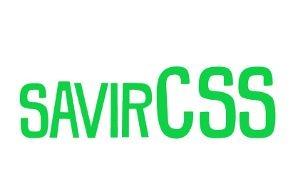

# SavirCSS
## A free, open-source CSS library.



### Add to your website
Add the following code to your head tag:
```
<link rel="stylesheet" href="https://savirsingh.github.io/SavirCSS/main.css">
```

### See all the styles
View the [Everything Page](https://savirsingh.github.io/SavirCSS/everything).

### Icons
We have amazing custom icon styles!
Check out the [Icons Page](https://savirsingh.github.io/SavirCSS/icons)


### Documentation & help
See the [Official Docs](https://savirsingh.github.io/SavirCSS/docs).

### Feedback & support
For feedback/support, create an issue or email kopichiki@gmail.com.
